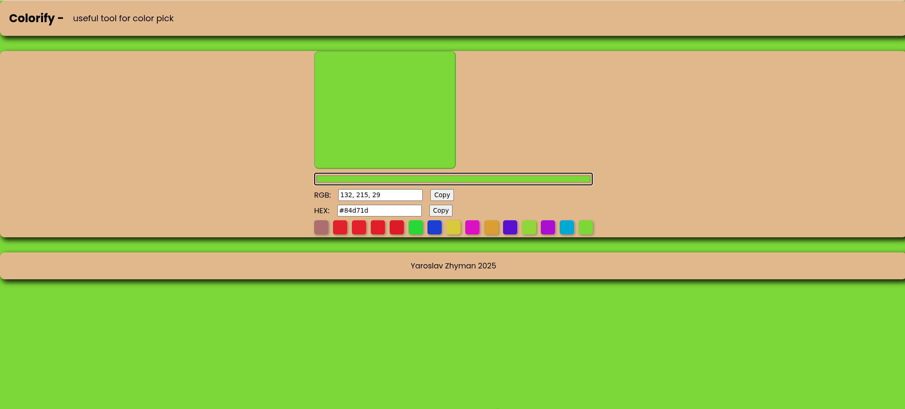

## 🎨 Colorify — Color Picker Tool

**Colorify** is a simple and elegant tool for selecting colors, displaying them in HEX and RGB formats, copying color codes, and saving a history of your last chosen colors.

## ✨ Features
- 📌 **Color selection** via `<input type="color">`
- 🎯 **Live color preview**
- 🔄 **Automatic HEX → RGB conversion**
- 📋 **Copy color codes** (by button or by clicking the field)
- 🕒 **Last 10 colors history**
- 💾 **History saved in LocalStorage**
- 🎨 **Background color changes** to the selected color
- ⚡ **Smooth color transition animation**

## 🖼 Interface Example


## 🚀 How to Run
1. Clone the repository:
   ```bash
   git clone https://github.com/yari4ek89/colorify.git

2. Navigate to the project folder:
   ```bash
   cd colorify

3. Open index.html in your browser.

## 📂 Project Structure

colorify/

├── index.html   # Main HTML markup

├── style.css    # Styling and animations

└── script.js    # App logic

## 📌 Technologies Used

- HTML5 — page structure
- CSS3 — styling & animations
- JavaScript (ES6) — event handling, DOM manipulation, LocalStorage

## 💡 Possible Improvements

- Support for HSL format
- Clear history button
- Multiple copy formats
- Adjustable history size

## 🌐 Live Demo
[Open Colorify in your browser](https://yari4ek89.github.io/colorify/)

## ✍ Developed with ❤️ by Yaroslav Zhyman, 2025
